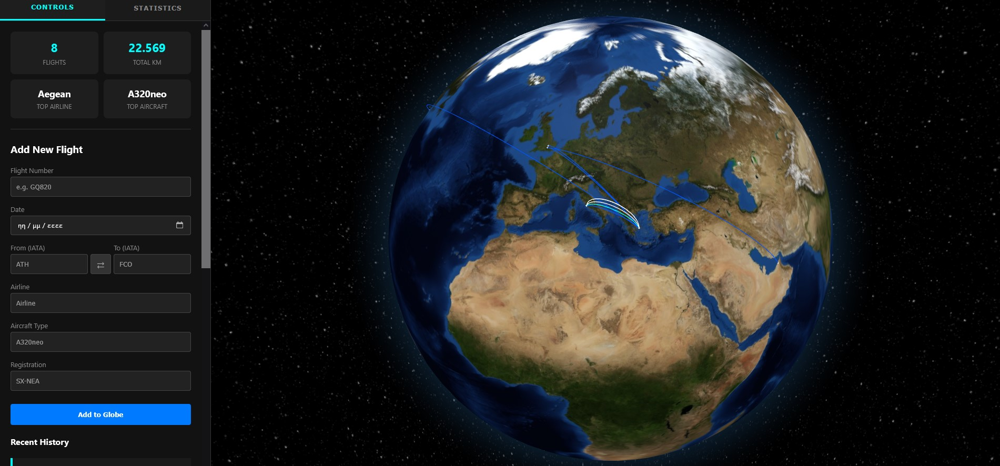
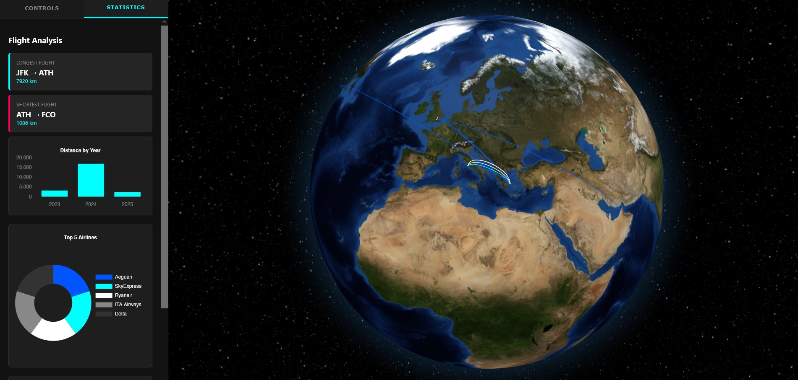

# Personal 3D Flight Tracker

A web-based application to visualize personal flight history on an interactive 3D globe. It allows users to log flights, view statistics, and explore travel history with high-definition rendering.





## Features


- **Interactive 3D Globe:** Built with Globe.gl, featuring high-res Blue Marble textures, bump mapping (topography), and a starfield background.
- **Flight Stacking:** Visualizes duplicate routes (e.g., flying ATH-FCO multiple times) by stacking arcs vertically and color-coding them (Blue -> Cyan -> White).
- **Airport Visualization:** Displays airports as flat dots on the map based on IATA codes.
- **Statistics Dashboard:** - Total kilometers flown.
  - Top airlines and aircraft types.
  - Interactive charts (Distance per Year, Top Airports, Top Airlines).
  - Longest and shortest flight records.
- **Autocomplete:** Smart suggestions for Airports (based on history), Airlines, and Aircraft types.
- **Data Persistence:** Saves all flight data locally to a JSON file.

## Tech Stack

- **Backend:** Python (Flask), Pandas, GeoPy.
- **Frontend:** HTML5, CSS3 (Flexbox/Grid), JavaScript.
- **Libraries:** Globe.gl (Three.js), Chart.js.
- **Data Source:** OpenFlights Airports Database (fetched dynamically).

## Installation

 **Install Dependencies**
   Run the following command in your terminal to install the required libraries:
   ```bash
   pip install flask pandas geopy
```
   ## How to run
   ```bash
python processor.py
   ```
or

   ```bash
python3 processor.py
   ```